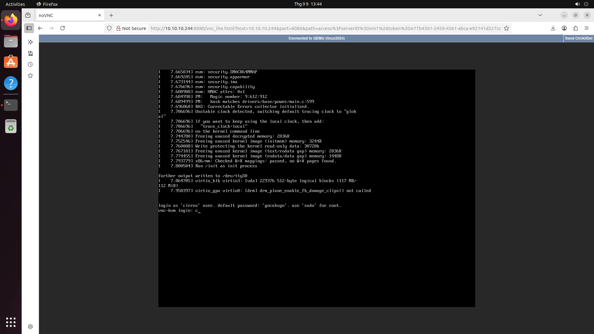

# building-webserver-for-vnc-proxy-

## Thông tin các server

- **Server 1:** `10.10.10.231`
- **Server 2:** `10.10.10.178`
- **Server 3:** `10.10.10.19`
- **VIP (Keepalived):** `10.10.10.244`

## Cấu trúc thư mục

```
.g
├── ansible/              # Chứa các Playbook để tự động hóa triển khai
│   ├── compose-playbook.yaml
│   └── inventory.yaml
├── haproxy/              # Cấu hình cho HAProxy
│   └── haproxy.cfg
├── keepalived/           # Cấu hình và script cho Keepalived
│   ├── scripts/
│   │   └── check_ha.sh
│   ├── 10.10.10.19.conf
│   ├── 10.10.10.178.conf
│   ├── 10.10.10.231.conf
│   └── ...
├── noVNC/                # Thư mục chứa mã nguồn noVNC
│   └── ...
├── requirements.txt      # Thư viện Python yêu cầu cho ứng dụng
├── vnc_proxy.py          # Mã nguồn ứng dụng Python
├── Dockerfile            # Dockerfile của dự án
├── docker-compose.yaml   # Docker compose
└── README.md             # file hướng dẫn thực hiện
```

## Build Docker Image

1. **Tạo SSH Key và gán vào các server**

- Tạo SSH key trên máy local (nếu chưa có):

  ```bash
  ssh-keygen -t rsa -b 4096
  ```

- Copy public key vào các server:

  ```bash
  ssh-copy-id user@10.10.10.231
  ssh-copy-id user@10.10.10.178
  ssh-copy-id user@10.10.10.19
  ```

2. **Build Docker image**

```bash
docker build -t khiempg225868/vnc-proxy-v2:2.2.2 .
```

3. **Push Docker image lên Docker Hub**

```bash
docker push khiempg225868/vnc-proxy-v2:2.2.2
```

4. **Chạy Ansible Playbook để triển khai**

- Sử dụng lệnh sau để chạy playbook để triển khai docker và docker compose, file cấu hình haproxy và cấu hình keepalived cho server:
  ```bash
  ansible-playbook -i ansible/inventory.yaml ansible/compose-playbook.yaml
  ```

## Khởi tạo MongoDB Cluster

1. **SSH vào một node bất kỳ (ví dụ: 10.10.10.19)**

```bash
ssh user@10.10.10.19
```

2. **Khởi tạo cluster cho MongoDB**

Mở shell MongoDB trong container và chạy lệnh sau:

```bash
docker exec -it <mongo_container_name> mongosh
```

```javascript
rs.initiate({
  _id: "rs0",
  members: [
    { _id: 0, host: "10.10.10.19:27017" },
    { _id: 1, host: "10.10.10.231:27017" },
    { _id: 2, host: "10.10.10.178:27017" },
  ],
});
```

3. **Kiểm tra trạng thái replica set**

Sau khi khởi tạo, kiểm tra trạng thái cluster bằng lệnh sau trong shell MongoDB:

```javascript
rs.status();
```

## Kết quả mong đợi của MongoDB Cluster

Sau khi khởi tạo, bạn nên thấy 1 node ở trạng thái **PRIMARY** và 2 node ở trạng thái **SECONDARY** khi kiểm tra bằng lệnh `rs.status();`.

**Ví dụ kết quả:**

```json
{
  "set": "rs0",
  "members": [
    {
      "name": "10.10.10.19:27017",
      "stateStr": "PRIMARY"
    },
    {
      "name": "10.10.10.231:27017",
      "stateStr": "SECONDARY"
    },
    {
      "name": "10.10.10.178:27017",
      "stateStr": "SECONDARY"
    }
  ]
}
```

## Chạy Ứng dụng

1. **Tạo mới token bằng lệnh curl**

```bash
curl -X POST -H "Content-Type: application/json" -d '{"nodeId": "vm2"}' http://10.10.10.244:5000/gentoken
```

**Ví dụ kết quả trả về:**

```json
{
  "token": "8f7d1e73-8df6-4c20-b3d4-018455a18e98"
}
```

2. **Truy cập ứng dụng qua trình duyệt**

Truy cập địa chỉ sau để sử dụng VNC qua web(thay serverID và token thực tế):

```
http://10.10.10.244:8080/vnc_lite.html?host=10.10.10.244&port=6080&path=access%3FserverID%3Dvm2%26token%3Dxxxxxxxx-xxxx-4c20-b3d4-018455a18e98
```

## Minh họa kết quả


